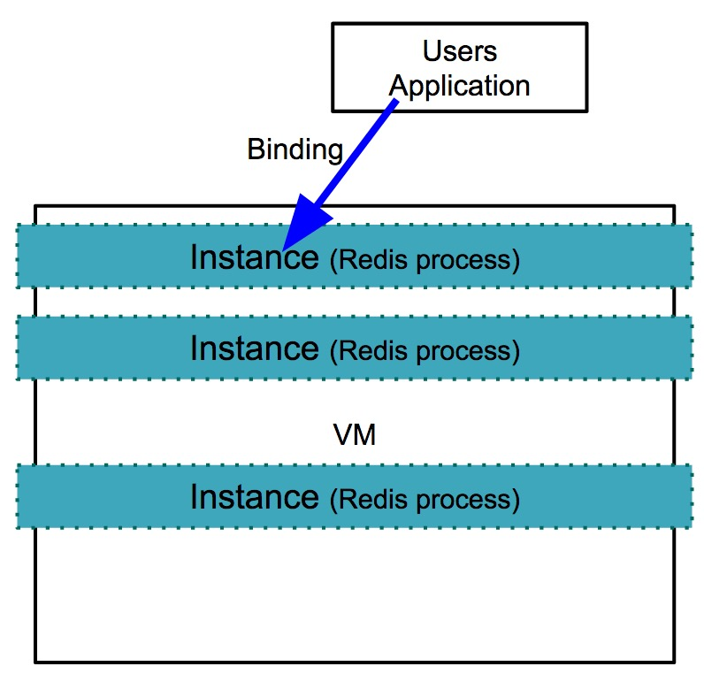
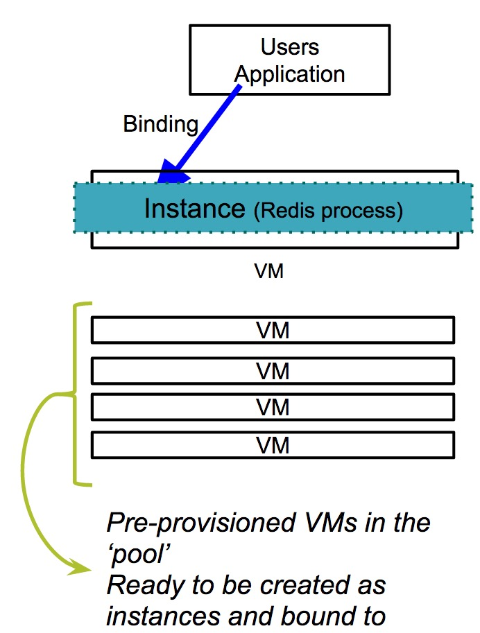

## Service Plan Descriptions
* [Shared-VM Plan](#shared)
* [Dedicated-VM Plan](#dedicated)

### Shared-VM Plan

An instance of this plan provisions a single Redis process on a single **shared VM** that is suitable for workloads which do not require dedicated hardware.

Data persistence is enabled through the use of `RDB` and `AOF`.

#### Operator Notes
* This plan deploys a shared VM and a single service broker VM.
* This plan can be disabled by setting the `Max instances limit` on the `Shared-VM Plan` tab in OpsManager to be `0`.
* The maximum number of instances can be increased from the default 5 to a value of your choosing. If you increase the number of instances that can be run on this single VM, you should consider increasing the resources allocated to the VM. In particular RAM and CPU. You can overcommit to a certain extent, but may start to see performance degradations.
* You can also increase the maximum amount of RAM allocated to each Redis process (service instance) that is running on this VM
* If you decrease the service instance limit, any instances that are running where the count is now greater than the limit are not terminated. They are left to be removed naturally, until the total count drops below the new limit you cannot create any new instances. For example if you had a limit of 10 and all were used and reduced this to 8, the two instances will be left running until you terminate them yourself.

#### Diagram

#### Known Limitations

Limitations with the current `shared-vm` plan include:

* It cannot be scaled beyond a single virtual machine.
* The following commands are disabled: `CONFIG`, `MONITOR`, `SAVE`, `BGSAVE`,
  `SHUTDOWN`, `BGREWRITEAOF`, `SLAVEOF`, `DEBUG`, and `SYNC`.
* Constraining CPU and/or disk usage is not supported.

### Dedicated-VM Plan

An instance of this plan, provisions a single Redis process, on a single **dedicated VM**, which is suitable for workloads that require isolation or dedicated hardware.

The following commands are enabled:

* `MONITOR`
* `SAVE`
* `BGSAVE`
* `BGREWRITEAOF`

Data persistence is enabled through the use of `RDB` and `AOF`.

The `maxmemory` value for the Redis process is set to be 45% of the RAM for that instance.

The persistent disk should be set to be at least the size of the RAM available to the VM or greater, in order to account for the final and temporary RDB file generated by the Redis background save.

#### Operator Notes

* This plan deploys several dedicated Redis VMs and a single service broker VM.
* These instances are pre-provisioned during the deployment of the tile from OpsManager into a **pool**. The VMs are provisioned and configured with a Redis process ready to be used when an instance of the `dedicated-vm` plan is requested.
* A default deployment will provision `5 instances` of the `dedicated-vm` plan into the **pool**. This number can be increased on the `Resource Config` tab in Ops Manager, either in the initial deployment, or subsequently thereafter. The number of VMs **cannot** be decreased once deployed.
* When a user provisions an instance, it is marked as in use and taken out of the **pool**.
* When a user deprovisions an instance, the instance is cleansed of any data and configuration to restore it to a fresh state and placed back into the pool, ready to be used again.
* This plan can be disabled by setting the number of instances of the `Dedicated node` job in Ops Manager to `0`.

#### Diagram

#### Known Limitations
Limitations with the current `dedicated-vm` plan include:

* No ability to change the Redis configuration. The `CONFIG` command is disabled.
* Cannot scale down the number of VMs on the plan once deployed.

## Highly Available Deployments

This plan is not intended for high availability. If your version of OpsManager supports multiple Availability Zones (AZs), instances of the `dedicated-vm` plan can be placed in multiple AZs, but they cannot be configured to act as master/slave nodes or to fail over. In addition, each plan can only have a single broker VM.

## Default Resources

### Resource requirements for Redis for PCF
These are the default resource and IP requirements for installing the tile
<table border="1" class="nice">
	<tr>
		<th>Product</th>
		<th>Resource</th>
		<th>Instances</th>
		<th>CPU</th>
		<th>Ram</th>
		<th>Ephemeral</th>
		<th>Persistent</th>
		<th>Static IP</th>
		<th>Dynamic IP</th>
	</tr>
	<tr>
 		<td>Redis</td>
	 	<td>Redis Broker</td>
	 	<td>1</td>
		<td>2</td>
	 	<td>3072</td>
		<td>4096</td>
	 	<td>9216</td>
	 	<td>1</td>
	 	<td>0</td>
 	</tr>
 	<tr>
 		<td>Redis</td>
 		<td>Dedicated Node</td>
 		<td>5</td>
 		<td>2</td>
 		<td>1024</td>
 		<td>4096</td>
 		<td>4096</td>
 		<td>1</td>
 		<td>0</td>
 	</tr>
 	<tr>
 		<td>Redis</td>
 		<td>Broker Registrar</td>
 		<td>1</td>
 		<td>1</td>
 		<td>1024</td>
 		<td>2048</td>
 		<td>0</td>
 		<td>0</td>
 		<td>1</td>
 	</tr>
	<tr>
		<td>Redis</td>
		<td>Broker De-Registrar</td>
		<td>1</td>
		<td>1</td>
		<td>1024</td>
		<td>2048</td>
		<td>0</td>
		<td>0</td>
		<td>1</td>
	</tr>
	<tr>
		<td>Redis</td>
		<td>Compliation</td>
		<td>2</td>
		<td>2</td>
		<td>1024</td>
		<td>4096</td>
		<td>0</td>
		<td>0</td>
		<td>1</td>
	</tr>
</table>

#### Notes:
* The `shared-vm` plan is on the `Redis Broker` resource
* The `dedicated-vm` plan is on the `Dedicated Node` resource

## Security
The following ports and ranges are used in this service:

* Destination port 80 access to the service broker from the cloud controllers
* Destination port 6379 access to all dedicated nodes from the Diego Cell and Diego Brain network(s)
* Destination ports 32768 to 61000 on the service broker from the Diego Cell and Diego Brain network(s). This is only required for the shared service plan.
* Outbound access to your chosen blobstore, typically HTTP 80 or HTTPS 443

